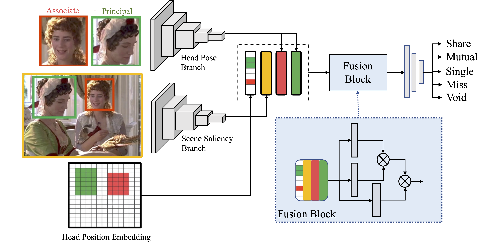

# GazeCommunication

ETRA work (under Construction)

:clock1: Overleaf link [ETRA 2023 paper under construction](https://www.overleaf.com/8542516856cjphkgqhqzvt)

## Intuition

**Following Gaze and Recognizing Patterns in Interpersonal Communication**

Analyzing gaze behaviors is crucial to interpret the nature of communication. But current studies of gaze patterns just focus on detecting a single specific pattern such as finding the Looking-At-Each Other pattern or shared attention pattern. It would be nice if we can have a framework to find all these patterns at once. Also, current studies on finding gaze patterns do not make use of the development in gaze estimation and gaze follow. One intuitive thought is that if the model can correctly predicts the spatial coordinates of a gaze point, it won't take much effort to learn and classify gaze patterns. 

Thus, in this work, we propose a novel framework that tackles the task of gaze pattern recognition. We propose a new dataset containing videos of interpersonal interaction scenes with gaze pattern annotations including both people looking at each other and share attention.

## Proposed Contribution

1. We propose a new taxonomy of static gaze patterns. It comprehensively describes the possible stationary gaze status of an individual in interpersonal communications. Under this taxonomy, we derive the task of classifying static gaze patterns in third-person view images. 
2. We build a dataset by annotating 370 videos of diverse social interactions with the proposed static gaze patterns.  
3. 

# Method

## Progress

### 🕐 Basic GazeFollow Model (Pretrain on GazeFollow)
### 🕐 Training and Performance on our dataset

### 🕐 Refractor the GazeFollow model to the general Gaze Pattern Recognition Tasks

| Dataset                                                          | UCO-LAEO | AVA-LAEO              | OI-MG                 | Shared Attention      |
|------------------------------------------------------------------|----------|-----------------------|-----------------------|-----------------------|
| Ours                                                             |**75.02**  | **82.52** | **72.1** | :white_medium_square: |
| LAEONet reported                                                 | **79.5** | 50.6                  | -                     | -                     |
| LAEONet Sinlge Frame (reported in *4)                            | 55.9     | 70.2                  | 59.8                  | -                     |
| Pseudo3DGaze                                                     | 65.1     | **72.2**              | **70.1**              | -                     |
| Gaze+RP+LSTM (Inferring Shared Attention in Social Scene Videos) | -        | -                     | -                     | **71.4**              |

